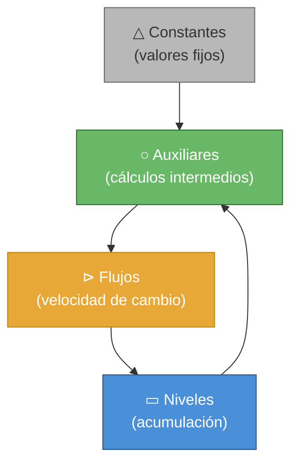
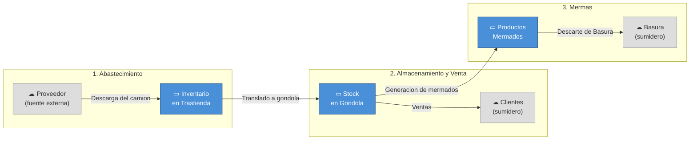

# Lectura del Diagrama de Forrester — Modelo de Inventario de Supermercado

## Parte 1: Introducción — Tipos de Variables en Dinámica de Sistemas

En un diagrama de Forrester, cada variable tiene un **rol específico** según cómo se comporta en el sistema. No es arbitrario: el tipo de variable se determina por su **naturaleza matemática y funcional**.

### ▭ Niveles (Stocks)

> [!IMPORTANT]
> Un **nivel** es una variable que **acumula** algo a lo largo del tiempo. Es como una bañera: el agua se acumula dentro.

- **Se identifica porque**: usa la función `INTEG()` en su ecuación
- **Unidades**: siempre en cantidad (Cajas, Litros, Personas...)
- **Símbolo visual**: Rectángulo (▭)
- **Concepto clave**: Un nivel **tiene memoria** — su valor actual depende de todo lo que ha pasado antes
- **Ecuación genérica**: `Nivel = INTEG(entradas - salidas, valor_inicial)`

**Analogía**: Una cuenta bancaria. El saldo (nivel) sube con depósitos (flujos de entrada) y baja con retiros (flujos de salida).

---

### ⊳ Flujos (Rates)

> [!IMPORTANT]
> Un **flujo** es la **velocidad** a la que algo entra o sale de un nivel. Es como el grifo de la bañera.

- **Se identifica porque**: sus unidades son `cantidad/tiempo` (Cajas/Day)
- **Y además**: aparece **dentro** de un `INTEG()` de algún nivel
- **Símbolo visual**: Válvula con tubería (⊳═══)
- **Concepto clave**: Un flujo **no acumula** nada, solo indica cuánto pasa por unidad de tiempo

**Analogía**: El flujo de agua del grifo (litros/minuto). No es agua acumulada, es la velocidad a la que entra.

---

### ○ Variables Auxiliares

> [!IMPORTANT]
> Una **auxiliar** es un cálculo intermedio que **combina** información de otras variables para alimentar flujos o niveles.

- **Se identifica porque**: tiene una fórmula que depende de otras variables, pero NO usa `INTEG()`
- **Unidades**: pueden ser de cualquier tipo
- **Símbolo visual**: Círculo o texto sin borde (○)
- **Concepto clave**: Es un cálculo "en tiempo real" — no tiene memoria, se recalcula cada paso de simulación

**Analogía**: Un termómetro. No acumula temperatura, solo *mide* la temperatura actual basándose en condiciones actuales.

---

### △ Constantes (Parámetros)

> [!IMPORTANT]
> Una **constante** es un valor fijo que **no cambia** durante la simulación. Representa supuestos o parámetros del sistema.

- **Se identifica porque**: su ecuación es simplemente `Variable = número`
- **Símbolo visual**: Igual que auxiliar, pero sin flechas que entren
- **Concepto clave**: El usuario puede modificarlas antes de simular para hacer escenarios "¿qué pasa si...?"

**Analogía**: La capacidad máxima de un tanque. No cambia durante la simulación, es un dato del diseño.

---

### Resumen visual de la jerarquía



> Las **constantes** alimentan **auxiliares**, que alimentan **flujos**, que llenan/vacían **niveles**. Los niveles a su vez influyen en las auxiliares (retroalimentación).

---

## Parte 2: Lectura del Modelo — Variable por Variable

### Estructura general del sistema

Tu modelo simula la **cadena de abastecimiento de un supermercado** con 3 subsistemas:



---

### 🔵 NIVELES (Stocks) — Las 3 "bañeras" del sistema

---

#### 1. Inventario en Trastienda

| Propiedad | Valor |
|-----------|-------|
| **Tipo** | ▭ Nivel (Stock) |
| **Unidades** | Cajas |
| **Valor inicial** | 400 Cajas |

**Fórmula:**
```
Inventario en Trastienda = INTEG(Descarga del camion - Translado a gondola, 400)
```

**Lectura**: Este nivel acumula cajas en la trastienda. **Sube** cuando llega el camión del proveedor y **baja** cuando se trasladan cajas a la góndola. Empieza con 400 cajas.

```
         Descarga del camion        Translado a gondola
  ☁ ═══════⊳═══════▶ ▭ Inventario ▶═══════⊳═══════▶ ...
                      en Trastienda
                       (400 cajas)
```

---

#### 2. Stock en Gondola

| Propiedad | Valor |
|-----------|-------|
| **Tipo** | ▭ Nivel (Stock) |
| **Unidades** | Cajas |
| **Valor inicial** | 150 Cajas |

**Fórmula:**
```
Stock en Gondola = INTEG(Translado a gondola - Generacion de mermados - Ventas, 150)
```

**Lectura**: La góndola recibe cajas de la trastienda (**+**), pero pierde cajas por dos caminos: **ventas** a clientes y **mermas** por deterioro. Tiene **1 entrada y 2 salidas**. Empieza con 150 cajas.

```
                              ┌──⊳── Ventas ──▶ ☁
  ... ══⊳══▶ ▭ Stock en ─────┤
              Gondola         └──⊳── Generacion de mermados ──▶ ...
              (150 cajas)
```

---

#### 3. Productos Mermados

| Propiedad | Valor |
|-----------|-------|
| **Tipo** | ▭ Nivel (Stock) |
| **Unidades** | Cajas |
| **Valor inicial** | 0 Cajas |

**Fórmula:**
```
Productos Mermados = INTEG(Generacion de mermados - Descarte de Basura, 0)
```

**Lectura**: Acumula los productos deteriorados. **Sube** cuando se generan mermas desde la góndola y **baja** cuando se descartan a la basura. Empieza vacío.

---

### 🟠 FLUJOS (Rates) — Los 5 "grifos" del sistema

---

#### 4. Descarga del camion

| Propiedad | Valor |
|-----------|-------|
| **Tipo** | ⊳ Flujo de entrada |
| **Unidades** | Cajas/Day |
| **Alimenta a** | Inventario en Trastienda (+) |

**Fórmula:**
```
Descarga del camion = IF THEN ELSE(
    Inventario en Trastienda < "Capacidad Max. trastienda",
    Tasa de llegada de camion,
    0
)
```

**Lectura**: El camión descarga cajas **solo si hay espacio** en la trastienda. Si `Inventario < 800`, descarga a la tasa normal. Si la trastienda está llena, **descarga = 0** (el camión se queda esperando).

> [!NOTE]
> Este es un flujo condicional — tiene una regla IF/THEN/ELSE que actúa como una "compuerta" de seguridad.

---

#### 5. Translado a gondola

| Propiedad | Valor |
|-----------|-------|
| **Tipo** | ⊳ Flujo intermedio |
| **Unidades** | Cajas/Day |
| **Sale de** | Inventario en Trastienda (-) |
| **Entra a** | Stock en Gondola (+) |

**Fórmula:**
```
Translado a gondola = MIN(Inventario en Trastienda / TIME STEP, Tasa de Reposición)
```

**Lectura**: Se trasladan cajas al ritmo que indica la Tasa de Reposición, **pero nunca más de lo que hay** en trastienda. Dividir `Inventario / TIME STEP` convierte las Cajas en una tasa máxima (Cajas/Day), haciendo que ambos argumentos del `MIN()` tengan las mismas unidades.

---

#### 6. Ventas

| Propiedad | Valor |
|-----------|-------|
| **Tipo** | ⊳ Flujo de salida |
| **Unidades** | Cajas/Day |
| **Sale de** | Stock en Gondola (-) |

**Fórmula:**
```
Ventas = MIN(Tasa de Ventas Concretadas, Stock en Gondola / TIME STEP)
```

**Lectura**: Se venden hasta 15 cajas/día, **pero nunca más de lo que hay** en góndola. Dividir `Stock / TIME STEP` convierte las Cajas en una tasa máxima (Cajas/Day) para que ambos argumentos del `MIN()` sean dimensionalmente consistentes.

---

#### 7. Generacion de mermados

| Propiedad | Valor |
|-----------|-------|
| **Tipo** | ⊳ Flujo intermedio |
| **Unidades** | Cajas/Day |
| **Sale de** | Stock en Gondola (-) |
| **Entra a** | Productos Mermados (+) |

**Fórmula:**
```
Generacion de mermados = Stock en Gondola × Tasa de generacion de mermas
```

**Lectura**: Cada día, el **0.5%** del stock en góndola se deteriora y pasa a ser "mermado". Cuantas más cajas haya en góndola, más mermas se generan (relación proporcional).

---

#### 8. Descarte de Basura

| Propiedad | Valor |
|-----------|-------|
| **Tipo** | ⊳ Flujo de salida |
| **Unidades** | Cajas/Day |
| **Sale de** | Productos Mermados (-) |

**Fórmula:**
```
Descarte de Basura = Productos Mermados × Tasa de descarte de mermados
```

**Lectura**: Cada día se descarta el **50%** de los productos mermados acumulados. Cuantos más mermados haya, más rápido se descartan.

---

### 🟢 VARIABLES AUXILIARES — Los 4 "cálculos intermedios"

---

#### 9. Tasa de Reposición

| Propiedad | Valor |
|-----------|-------|
| **Tipo** | ○ Auxiliar |
| **Unidades** | Cajas/Day |

**Fórmula:**
```
Tasa de Reposición = IF THEN ELSE(
    Inventario en Trastienda > 0,
    SMOOTH(Faltante Stock, 0.5) / Tiempo de ajuste de reposicion,
    0
)
```

**Lectura**: Si hay inventario en trastienda, la reposición se basa en cuánto falta en góndola, **suavizada** con `SMOOTH()` y luego **dividida entre el tiempo de ajuste** (1 Day) para convertir Cajas → Cajas/Day. Si la trastienda está vacía, la reposición es 0.

> [!NOTE]
> `SMOOTH(x, t)` devuelve las mismas unidades que `x` (Cajas). Dividir entre `Tiempo de ajuste de reposicion` (Day) produce Cajas/Day, corrigiendo la consistencia dimensional.

---

#### 10. Tasa de llegada de camion

| Propiedad | Valor |
|-----------|-------|
| **Tipo** | ○ Auxiliar |
| **Unidades** | Cajas/Day |

**Fórmula:**
```
Tasa de llegada de camion = Faltante Trastienda / Tiempo de retraso del proveedor
```

**Lectura**: El proveedor intenta reponer lo que falta en trastienda, pero tarda `2 días` en entregar. Si faltan 100 cajas, llegan 50/día durante 2 días.

---

#### 11. Faltante Stock

| Propiedad | Valor |
|-----------|-------|
| **Tipo** | ○ Auxiliar |
| **Unidades** | Cajas |

**Fórmula:**
```
Faltante Stock = MAX(0, Nivel Objetivo Gondola - Stock en Gondola)
```

**Lectura**: Calcula cuántas cajas faltan para alcanzar el objetivo de 200 en góndola. El `MAX(0, ...)` asegura que si hay **más** de 200, el faltante sea 0 (no un número negativo).

---

#### 12. Faltante Trastienda

| Propiedad | Valor |
|-----------|-------|
| **Tipo** | ○ Auxiliar |
| **Unidades** | Cajas |

**Fórmula:**
```
Faltante Trastienda = MAX(0, Nivel Objetivo Trastienda - Inventario en Trastienda)
```

**Lectura**: Igual que el anterior, pero para la trastienda. Calcula cuántas cajas faltan para alcanzar el objetivo de 500.

---

### ⬜ CONSTANTES (Parámetros) — Los 7 "supuestos"

| # | Variable | Valor | Unidades | Significado |
|---|----------|-------|----------|-------------|
| 13 | Capacidad Max. trastienda | **800** | Cajas | Límite físico de almacenamiento |
| 14 | Nivel Objetivo Gondola | **200** | Cajas | Meta de stock en góndola |
| 15 | Nivel Objetivo Trastienda | **500** | Cajas | Meta de stock en trastienda |
| 16 | Tasa de Ventas Concretadas | **15** | Cajas/Day | Demanda diaria de clientes |
| 17 | Tasa de generacion de mermas | **0.005** | 1/Day | 0.5% del stock se merma por día |
| 18 | Tasa de descarte de mermados | **0.5** | 1/Day | 50% de mermados se descarta por día |
| 19 | Tiempo de retraso del proveedor | **2** | Day | Demora del proveedor en entregar |
| 20 | Tiempo de ajuste de reposicion | **1** | Day | Convierte faltante (Cajas) en tasa (Cajas/Day) |

> [!TIP]
> Estas constantes son las que puedes modificar en Vensim (con los sliders) para explorar escenarios: ¿Qué pasa si la demanda sube a 30 cajas/día? ¿Y si el proveedor tarda 5 días?

---

## Parte 3: Configuración de Simulación

| Parámetro | Valor | Significado |
|-----------|-------|-------------|
| INITIAL TIME | 0 | La simulación empieza en el día 0 |
| FINAL TIME | 90 | La simulación termina en el día 90 (3 meses) |
| TIME STEP | 0.25 | Se calcula cada 6 horas (1/4 de día) |
| SAVEPER | TIME STEP | Se guarda un dato cada 6 horas |

---

## Resumen: Clasificación completa del modelo

| Variable | Tipo | Ecuación resumida |
|----------|------|-------------------|
| Inventario en Trastienda | ▭ Nivel | `INTEG(Descarga - Translado, 400)` |
| Stock en Gondola | ▭ Nivel | `INTEG(Translado - Mermas - Ventas, 150)` |
| Productos Mermados | ▭ Nivel | `INTEG(Mermas - Descarte, 0)` |
| Descarga del camion | ⊳ Flujo | `IF hay espacio → Tasa llegada, ELSE 0` |
| Translado a gondola | ⊳ Flujo | `MIN(Inventario/TIME STEP, Tasa Reposición)` |
| Ventas | ⊳ Flujo | `MIN(Tasa Ventas, Stock Gondola/TIME STEP)` |
| Generacion de mermados | ⊳ Flujo | `Stock Gondola × 0.005` |
| Descarte de Basura | ⊳ Flujo | `Prod. Mermados × 0.5` |
| Tasa de Reposición | ○ Auxiliar | `IF hay stock → SMOOTH(Faltante, 0.5)/T.ajuste` |
| Tasa de llegada de camion | ○ Auxiliar | `Faltante Trastienda / 2 días` |
| Faltante Stock | ○ Auxiliar | `MAX(0, Objetivo - Stock Gondola)` |
| Faltante Trastienda | ○ Auxiliar | `MAX(0, Objetivo - Inv. Trastienda)` |
| Capacidad Max. trastienda | △ Constante | `800 Cajas` |
| Nivel Objetivo Gondola | △ Constante | `200 Cajas` |
| Nivel Objetivo Trastienda | △ Constante | `500 Cajas` |
| Tasa de Ventas Concretadas | △ Constante | `15 Cajas/Day` |
| Tasa de generacion de mermas | △ Constante | `0.005 (1/Day)` |
| Tasa de descarte de mermados | △ Constante | `0.5 (1/Day)` |
| Tiempo de retraso del proveedor | △ Constante | `2 Days` |
| Tiempo de ajuste de reposicion | △ Constante | `1 Day` |
